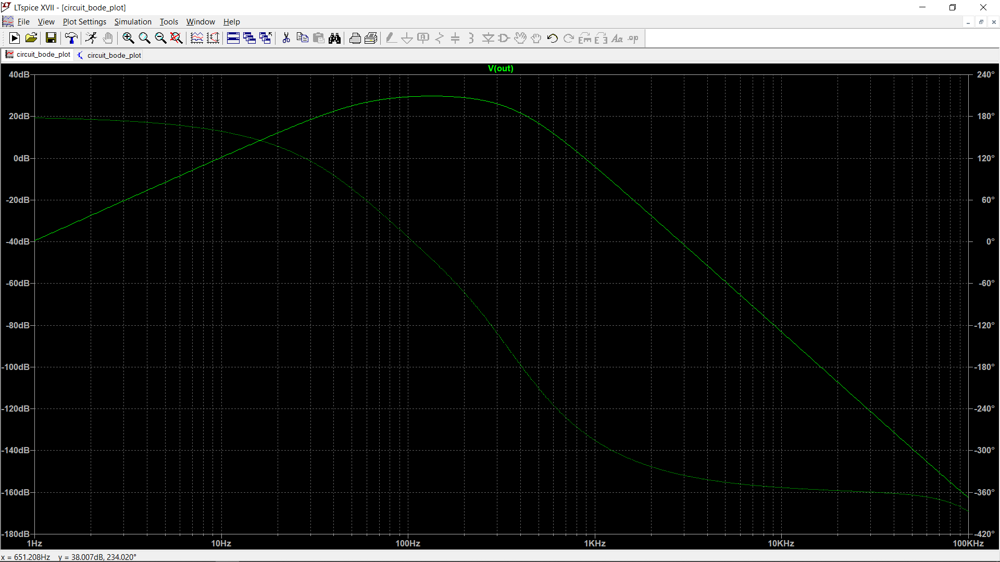

# Medical Research Project
## Circuit schematic diagram
This circuit is inspired by [this paper](https://pdfs.semanticscholar.org/c348/f06416aa03154c40bb82d5b26cef40e5840d.pdf), initially proposed by J. Wang et al.

## Simulation

## Fast Fourier Transform

## Bode plot

